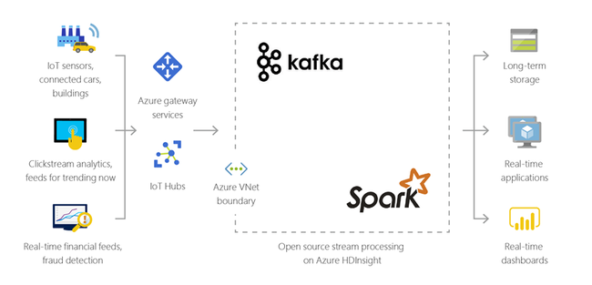
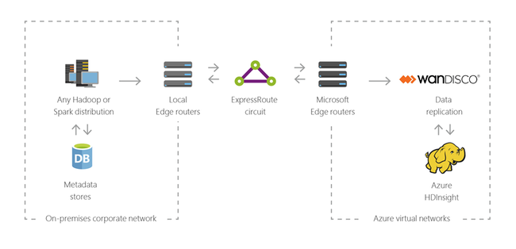

# ¿Qué es Azure HDInsight?

**Fuente**:

[What is Azure HDInsight | Microsoft Learn](https://learn.microsoft.com/en-us/azure/hdinsight/hdinsight-overview)

**Índice de contenidos**:

- [¿Qué es Azure HDInsight?](#qué-es-azure-hdinsight)
  - [¿Qué es HDInsight y el stack de tecnologías Hadoop?](#qué-es-hdinsight-y-el-stack-de-tecnologías-hadoop)
  - [¿Por qué debería usar Azure HDInsight?](#por-qué-debería-usar-azure-hdinsight)
    - [¿Qué es Big Data?](#qué-es-big-data)
  - [Tipos de clúster en HDInsight](#tipos-de-clúster-en-hdinsight)
  - [Escenarios de uso de HDInsight](#escenarios-de-uso-de-hdinsight)
    - [Procesamiento por lotes (ETL)](#procesamiento-por-lotes-etl)
    - [Almacenamiento de datos (Data Warehousing)](#almacenamiento-de-datos-data-warehousing)
    - [Internet de las Cosas (IoT)](#internet-de-las-cosas-iot)
    - [Híbrido](#híbrido)
  - [Componentes de código abierto en HDInsight](#componentes-de-código-abierto-en-hdinsight)
  - [Lenguajes de programación en HDInsight](#lenguajes-de-programación-en-hdinsight)
  - [Herramientas de desarrollo para HDInsight](#herramientas-de-desarrollo-para-hdinsight)
  - [Inteligencia empresarial (BI) en HDInsight](#inteligencia-empresarial-bi-en-hdinsight)
  - [Residencia de datos en la región](#residencia-de-datos-en-la-región)

**Azure HDInsight** es un servicio en la nube totalmente **administrado** y enfocado en **análisis de datos** para empresas. Este servicio permite usar herramientas y frameworks de **código abierto** como _Spark_, _Hive_, _LLAP_, _Kafka_, _Hadoop_ y otros en el entorno de Azure.

## ¿Qué es HDInsight y el stack de tecnologías Hadoop?

HDInsight es una plataforma administrada en Azure que facilita el uso de frameworks de Big Data. Estos frameworks permiten trabajar con grandes volúmenes de datos de manera rápida y eficiente.

## ¿Por qué debería usar Azure HDInsight?

| Capacidad                  | Descripción |
|----------------------------|-------------|
| **Nativo en la nube**      | Permite crear clústeres optimizados para varias tecnologías de Big Data en Azure, con SLA completo para cargas de trabajo en producción. |
| **Bajo costo y escalable** | Escala cargas de trabajo fácilmente y paga solo por el uso. La separación de cómputo y almacenamiento mejora el rendimiento y flexibilidad. |
| **Seguro y compatible**    | Protege datos empresariales con cifrado, redes virtuales y cumple con normas de la industria. |
| **Monitoreo**              | Integra Azure Monitor para gestionar clústeres desde una sola interfaz. |
| **Disponibilidad global**  | Disponible en más regiones, incluyendo Azure Government, China y Alemania. |
| **Productividad**          | Compatible con herramientas de desarrollo populares (Visual Studio, VS Code, etc.) para Hadoop y Spark. |
| **Extensibilidad**         | Permite añadir componentes y aplicaciones de Big Data de manera sencilla. |

> Un **SLA** (**Service Level Agreement**, por sus siglas en inglés) es un acuerdo formal entre un proveedor de servicios y un cliente que establece los niveles de servicio que se esperan.

### ¿Qué es Big Data?

El Big Data se recopila en volúmenes cada vez mayores, con mayor velocidad y en una mayor variedad de formatos que nunca. Puede ser **histórico** (almacenado) o en **tiempo real** (transmitido directamente desde la fuente).

## Tipos de clúster en HDInsight

HDInsight ofrece diferentes tipos de clústeres que pueden ser personalizados, permitiendo agregar componentes, utilidades y lenguajes. Los tipos de clústeres disponibles son:

| **Tipo de clúster**            | **Descripción**                                                                                                                                                  |
|-----------------------------|------------------------------------------------------------------------------------------------------------------------------------------------------------------|
| **Apache Hadoop**            | Framework que usa HDFS, YARN y MapReduce para procesar y analizar datos por lotes en paralelo.                                                                  |
| **Apache Spark**             | Framework de procesamiento paralelo que usa memoria para mejorar el rendimiento de las aplicaciones de Big Data.                                                  |
| **Apache HBase**             | Base de datos NoSQL sobre Hadoop que ofrece acceso aleatorio y consistencia para grandes volúmenes de datos no estructurados y semi-estructurados.                 |
| **Apache Interactive Query** | Caching en memoria para realizar consultas de Hive de forma más rápida e interactiva.                                                                             |
| **Apache Kafka**             | Plataforma para construir pipelines de datos en tiempo real y aplicaciones de streaming con funcionalidad de colas de mensajes.                                   |

> El **caching** es una técnica de almacenamiento temporal de datos en una memoria de acceso rápido (como la RAM) para que las aplicaciones puedan acceder a ellos más rápidamente.

> Un **pipeline** de datos es una cadena de procesos que mueve y transforma datos de un lugar a otro de manera automática.

> Un **clúster** es un grupo de máquinas que trabajan juntas para procesar y almacenar grandes cantidades de datos de manera eficiente y rápida.

## Escenarios de uso de HDInsight

Azure HDInsight se puede utilizar para diferentes escenarios de procesamiento de Big Data, tanto con datos históricos (ya recolectados y almacenados) como con datos en tiempo real (transmitidos directamente desde la fuente).

### Procesamiento por lotes (ETL)

El proceso _Extract, Transform, Load_ (ETL) consiste en extraer datos de diversas fuentes, transformarlos en un formato estructurado y luego cargarlos en un almacén de datos. Estos datos transformados se pueden usar para análisis de datos o almacenamiento de datos.

### Almacenamiento de datos (Data Warehousing)

HDInsight permite realizar consultas interactivas a gran escala (hasta petabytes) sobre datos estructurados o no estructurados en cualquier formato. También es posible construir modelos y conectarlos a herramientas de inteligencia empresarial (BI).

### Internet de las Cosas (IoT)

HDInsight permite procesar datos que se reciben al instante desde dispositivos conectados, como parte del _Internet of Things_ (IoT).

### Híbrido

HDInsight te permite conectar y mejorar tu infraestructura de Big Data local con las herramientas y recursos avanzados de análisis que ofrece la nube de Azure.

## Componentes de código abierto en HDInsight

Azure HDInsight te permite crear clústeres con **frameworks** de código abierto como Spark, Hive, LLAP, Kafka, Hadoop y HBase. De forma predeterminada, estos clústeres incluyen **componentes** de código abierto como Apache Ambari, Avro, Apache Hive 3, HCatalog, Apache Hadoop MapReduce, Apache Hadoop YARN, Apache Phoenix, Apache Pig, Apache Sqoop, Apache Tez, Apache Oozie y Apache ZooKeeper.

## Lenguajes de programación en HDInsight

Los clústeres de HDInsight, como Spark, HBase, Kafka y Hadoop, soportan varios lenguajes de programación. Algunos lenguajes no vienen instalados por defecto, pero se pueden agregar mediante scripts.

| Lenguaje de programación           | Información                                                             |
|------------------------------------|-------------------------------------------------------------------------|
| **Lenguajes soportados por defecto** | HDInsight soporta de forma predeterminada: Java, Python, .NET, Go.        |
| **Lenguajes basados en JVM**       | Se pueden usar lenguajes como Clojure, Jython (Python para Java) y Scala, pero requieren componentes adicionales. |
| **Lenguajes específicos de Hadoop** | HDInsight soporta lenguajes como Pig Latin para trabajos de Pig, y HiveQL para trabajos de Hive y SparkSQL. |

## Herramientas de desarrollo para HDInsight

Puedes usar herramientas de desarrollo como IntelliJ, Eclipse, Visual Studio Code y Visual Studio para crear y enviar consultas y trabajos de datos en HDInsight, todo con integración directa en Azure.

- Azure toolkit para IntelliJ 10
- Azure toolkit para Eclipse 6
- Herramientas de HDInsight para VS Code 13
- Herramientas de Azure Data Lake para Visual Studio 9

## Inteligencia empresarial (BI) en HDInsight

Puedes usar herramientas comunes de BI _(Business Intelligence)_, como Power BI y Excel, para trabajar con datos de HDInsight. Estas herramientas se conectan a HDInsight a través de Power Query o el controlador ODBC de Hive, lo que permite visualizar y analizar datos de Apache Spark o Hive.

## Residencia de datos en la región

> Residencia de datos en la región significa que los datos deben almacenarse en una ubicación geográfica específica, como un país o región, para cumplir con regulaciones legales y de privacidad.

- Spark, Hadoop y LLAP no almacenan datos de clientes, por lo que estos servicios cumplen automáticamente con los requisitos de residencia de datos en la región establecidos en el Trust Center.

- Kafka y HBase sí almacenan datos de clientes, pero estos servicios guardan la información en una sola región, cumpliendo también con los requisitos de residencia de datos en la región según el Trust Center.
